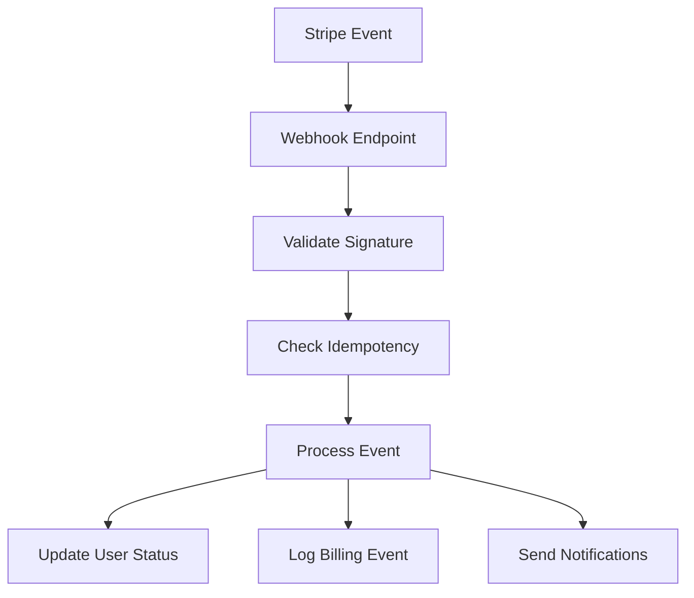

# Stripe Webhook Handling System

## Overview
This document outlines the Stripe webhook handling system implemented in `app/payment/stripe_webhooks.py`. The system processes various Stripe events to manage user subscriptions, payments, and account status.

## Event Flow

## Event Handlers

### User Creation & Checkout
- `checkout.session.completed`
  - Creates new user or updates existing user
  - Sets up initial subscription
  - Sends welcome email
  - Generates password reset token

### Subscription Management
- `customer.subscription.created`
  - Logs new subscription creation
  - Records subscription details
- `customer.subscription.updated`
  - Updates subscription status
  - Handles trial period changes
  - Processes cancellations
- `customer.subscription.deleted`
  - Logs subscription deletion
  - Records cancellation details
- `customer.subscription.trial_will_end`
  - Logs trial ending event
  - Note: Stripe handles notification emails

### Payment Processing
- `payment_intent.created`
  - Logs payment intent creation
  - Records payment details
- `payment_intent.succeeded`
  - Logs successful payment
  - Records payment details
- `payment_intent.payment_failed`
  - Logs payment failure
  - Updates user status if needed
  - Note: Stripe handles failure notifications
- `charge.succeeded`
  - Logs successful charge
  - Records charge details
- `charge.failed`
  - Logs charge failure
  - Updates user status if needed
  - Note: Stripe handles failure notifications
- `charge.refunded`
  - Logs refund details
  - Records refund amount
- `charge.dispute.created`
  - Logs dispute creation
  - Records dispute reason and status

### Invoice Management
- `invoice.created`
  - Logs invoice creation
  - Records invoice details
- `invoice.updated`
  - Logs invoice updates
  - Records status changes
- `invoice.finalized`
  - Logs invoice finalization
  - Records final amount
- `invoice.paid`
  - Logs successful payment
  - Records payment details
- `invoice.payment_succeeded`
  - Updates subscription status
  - Extends subscription period
  - Handles trial period invoices
- `invoice.payment_failed`
  - Logs payment failure
  - Records failure details
  - Note: Stripe handles failure notifications

### Customer Management
- `customer.created`
  - Logs customer creation
  - Records customer details
- `customer.updated`
  - Updates user information
  - Records changes
- `customer.source.expiring`
  - Logs expiring payment method
  - Records expiry details
- `customer.source.updated`
  - Logs payment method updates
  - Records new payment method details

### Payment Method Setup
- `setup_intent.created`
  - Logs setup intent creation
  - Records setup details
- `setup_intent.succeeded`
  - Updates user's payment method
  - Records new payment method
- `setup_intent.failed`
  - Logs setup failure
  - Records failure details

## Error Handling
- All events are logged with detailed error information
- Failed events don't block user creation or updates
- Duplicate events are handled through idempotency checks
- All errors are logged for monitoring and debugging

## Notification System
- Welcome emails for new users
- Password reset emails
- Note: Most payment and subscription notifications are handled by Stripe

## Database Updates
- User status changes
- Subscription period updates
- Payment method updates
- Trial period tracking
- Billing event logging

## Security
- Webhook signature verification
- Idempotency checks
- Secure error handling
- No sensitive data logging

## Monitoring
- Detailed logging of all events
- Billing event tracking
- Error monitoring
- User status changes

## Best Practices
1. Always verify webhook signatures
2. Implement idempotency checks
3. Log all events for debugging
4. Handle errors gracefully
5. Don't duplicate Stripe's notifications
6. Keep sensitive data out of logs
7. Update user status appropriately
8. Monitor failed payments
9. Track subscription changes
10. Maintain audit trail

## Configuration
Required environment variables:
- `STRIPE_SECRET_KEY`
- `STRIPE_ENDPOINT_SECRET`
- `MAILGUN_API_KEY`
- `MAILGUN_DOMAIN`
- `MAILGUN_SENDER_EMAIL`

## Testing
To test webhook handling:
1. Use Stripe CLI for local testing
2. Monitor logs for event processing
3. Verify database updates
4. Check email delivery
5. Validate error handling

## Troubleshooting
Common issues and solutions:
1. Webhook signature verification failures
   - Check endpoint secret
   - Verify request headers
2. Duplicate event processing
   - Check idempotency implementation
   - Verify event ID tracking
3. Failed payments
   - Check payment method validity
   - Verify subscription status
4. Missing notifications
   - Check email configuration
   - Verify template rendering
5. Database update failures
   - Check user existence
   - Verify data integrity 